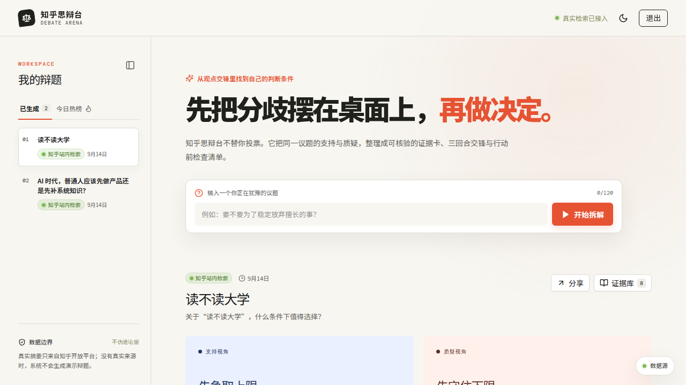
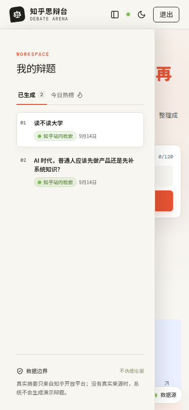

# 知乎思辩台 · Debate Arena

> **把知乎的观点交锋，整理成自己的判断条件。**

知乎思辩台是一款面向复杂选择的证据驱动决策工作台。用户输入一个正在犹豫的议题，系统在登录后调用知乎开放平台站内搜索，把真实检索摘要、原文链接与来源字段整理成证据卡，再组织为“立论—攻防—终局”三回合交锋，最后生成行动前检查清单。

产品不替用户投票，也不把摘要伪装成原作者完整观点。未登录用户只能浏览已经保存的真实辩题；只有完成登录后才能进行新的知乎检索与拆解。没有真实来源时，系统拒绝生成辩题，不创建演示数据。

## 在线入口

- **作品短链接：** [https://link.heabl.xyz/zhihu](https://link.heabl.xyz/zhihu)
- **GitHub：** [he9ab2l/zhihu-debate-arena](https://github.com/he9ab2l/zhihu-debate-arena)
- **产品说明计划书：** [docs/PRODUCT_PLAN.md](docs/PRODUCT_PLAN.md)
- **提交材料：** [docs/SUBMISSION.md](docs/SUBMISSION.md)

## 视觉预览

### 桌面端工作台



### 移动端工作台



### 产品演示视频

[下载或播放产品演示视频](docs/zhihu-debate-arena-demo.mp4)

视频依次演示：访客浏览、登录门槛、议题拆解、左右视角、证据库、三回合交锋、独立内容滚动、数据源面板和 AI 三种总结范围。

## 核心能力

| 能力 | 说明 |
| --- | --- |
| 登录门槛 | 访客只读；登录后才能发起知乎搜索与拆解 |
| 真实检索 | 服务端调用知乎开放平台 `zhihu_search`，保留原文链接与来源字段 |
| 历史保存 | 所有成功拆解结果持久化，并在左侧“我的辩题”中展示 |
| 三回合交锋 | 立论明确下注，攻防拆解前提，终局落到可执行条件 |
| 证据透明 | 证据抽屉展示标题、摘要、作者、内容类型与知乎原文链接 |
| 热榜发现 | 热榜只填入输入框，不自动消耗搜索额度 |
| AI 总结 | 支持单篇证据、整场辩题、三回合综合；输出严格标注证据边界 |
| 不伪造 | 无真实来源时拒绝保存或展示演示辩题 |
| 响应式布局 | 桌面侧栏可折叠，移动端使用单一抽屉入口，右侧面板具备实体背景 |

## 来源与安全边界

知乎 Access Secret、AI API Key 和 AI API URL 只配置在服务端 Secret 中。前端只获取脱敏的连接状态。证据中的文字是开放平台返回的检索摘要，不是知乎全文；产品持续提供原文入口，提醒用户自行核验上下文。

AI 总结只根据当前辩题中的真实摘要、来源 ID、三回合结构和已保存检查清单生成。AI 不补造作者、数据、时间、来源链接或因果关系；证据不足时必须明确写出“证据不足”。AI 输出不是医疗、法律、投资或职业保证，也不替用户做决定。

知乎登录接口已预留，正式联调需要知乎开放平台 OAuth App ID、App Key、App Secret 和登记后的回调地址。当前登录流程仍使用 Manus OAuth，知乎 OAuth 不在没有应用凭证时伪造上线。

## 技术架构

```text
React 19 + Vite + Tailwind 4
              │
              ▼
       tRPC 11 typed API
              │
      Express 4 / Node.js
       ┌──────┼──────────┐
       │      │          │
   Drizzle  Zhihu      AI API
   MySQL    HTTP API   OpenAI-compatible
       │      │          │
       └──────┴──────────┘
          persisted debates
```

前端只通过 tRPC 调用后端。服务端负责知乎检索、AI 请求、凭证边界、无来源拒绝和数据库持久化。

## 本地开发

```bash
pnpm install
pnpm dev
```

检查、测试和生产构建：

```bash
pnpm check
pnpm test
pnpm build
```

## 服务端配置

```bash
ZHIHU_ACCESS_SECRET=你的知乎开放平台 Access Secret
AI_API_KEY=你的 AI API Key
AI_API_URL=https://你的兼容接口/v1
AI_MODEL=gemini-3.8-flash
```

不要把这些值写入 Git、README 或任何 `VITE_` 前缀变量。推荐使用 WebDev Secret 管理。

## 参考资料

[1]: https://link.heabl.xyz/zhihu "知乎思辩台在线作品"
[2]: https://developer.zhihu.com/profile "知乎开放平台开发者后台"
[3]: https://github.com/he9ab2l/zhihu-debate-arena "知乎思辩台 GitHub 仓库"
[4]: https://www.zhihu.com/ring/moltbook/api/community/quickstart "知乎开放平台社区快速开始"

## License

MIT

本 README 由 Manus AI 重写，最终版本以线上作品和仓库实际代码为准。

参见 [1] [2] [3] [4]。
