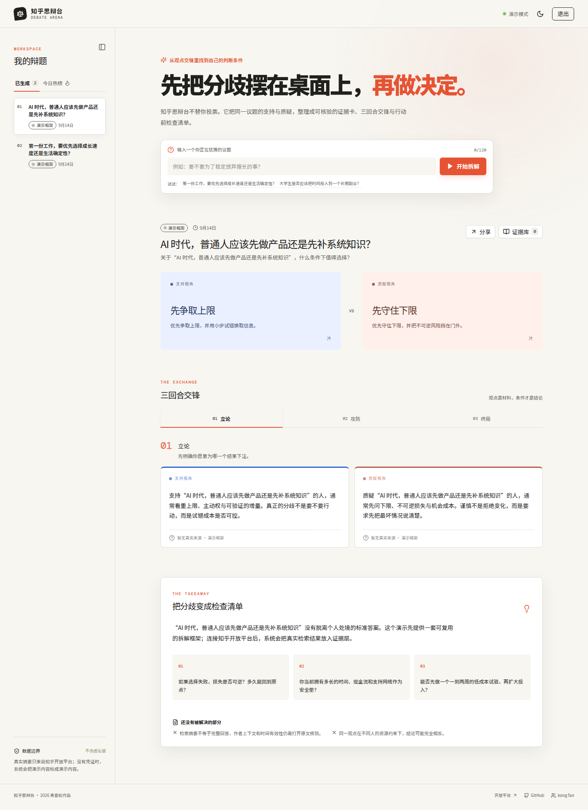
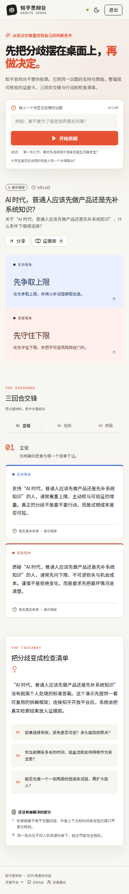

# 知乎思辩台 · Debate Arena

> **把知乎的观点交锋，整理成自己的判断条件。**

知乎思辩台是一款面向复杂选择的证据驱动决策工作台。用户输入一个正在犹豫的议题，系统优先调用知乎开放平台站内搜索，把可核验的内容摘要、原文链接与作者信息整理成证据层，再将议题组织为“立论—攻防—终局”三回合交锋，最后输出行动前检查清单。

它不替用户投票，也不把摘要伪装成原作者立场。没有 Access Secret 时，产品会明确进入演示模式：可以完整体验信息架构与交互，但不会虚构知乎来源、作者、赞同数或剩余额度。

## 在线 Demo

**作品链接：** [打开知乎思辩台在线 Demo](https://3000-ip6lhwt15g4ve2pkznobs-45140197.sg2.manus.computer)

该链接是当前可访问的 WebDev 预览部署，支持桌面端和移动端响应式布局。Demo 默认以“演示模式”运行；配置服务端 `ZHIHU_ACCESS_SECRET` 后，自动切换为真实搜索、热榜和额度查询。

## 视觉预览

### 桌面端工作台



### 移动端工作台



### 产品演示视频

[播放或下载中文产品演示视频](docs/zhihu-debate-arena-demo.mp4)

视频内容包括：输入议题、双方视角、三回合交锋、证据库、数据源透明状态与行动前检查清单。

## 核心能力

| 能力 | 说明 |
| --- | --- |
| 议题拆解 | 将一个模糊选择转换为支持视角、质疑视角和决策问题 |
| 真实检索 | 服务端调用知乎开放平台 `zhihu_search`，保留原文链接与来源字段 |
| 三回合交锋 | 立论明确下注、攻防拆解前提、终局落到可执行条件 |
| 证据透明 | 证据抽屉展示标题、摘要、作者、内容类型与知乎原文链接 |
| 热榜发现 | 调用知乎开放平台 `hot_list`，点击热榜只填入输入框，不自动消耗检索额度 |
| 额度可见 | 调用 `quota` 展示真实额度；未连接时不显示估算数字 |
| 不伪造降级 | 没有凭证时只展示无来源的演示框架，并把状态明确标为“演示模式” |
| 持久化 | 使用 MySQL/TiDB 保存生成的辩题 JSON，支持访客模式和 Manus OAuth 登录 |
| 导出友好 | 页面结构适合截图、分享与后续扩展导出 |

## 知乎 Skill 规范落实

本项目按照随附的 `zhihu-cli-skill` 规范设计，但考虑到线上托管环境不能依赖本机 CLI，线上服务采用规范中定义的 HTTP API 语义：

1. 使用 `Authorization: Bearer <Access Secret>` 与秒级 `X-Request-Timestamp`。
2. 站内搜索调用 `GET https://developer.zhihu.com/api/v1/content/zhihu_search`。
3. 热榜调用 `GET https://developer.zhihu.com/api/v1/content/hot_list`。
4. 额度调用 `GET https://developer.zhihu.com/api/v1/quota`。
5. Access Secret 仅作为托管平台服务端 Secret，不进入前端、不写入 GitHub、不写入日志。
6. 搜索返回的摘要始终标为“检索摘要”，不宣称为作者完整观点。
7. 网络、鉴权、额度或接口异常时，系统给出明确原因并安全降级，不制造伪造数据。
8. 证据卡保留原始 URL，提醒用户打开知乎原文核验上下文。

## 技术架构

```text
React 19 + Vite + Tailwind 4
              │
              ▼
       tRPC 11 typed API
              │
      Express 4 / Node.js
       ┌──────┼──────────┐
       │      │          │
  Drizzle   Zhihu     Manus OAuth
  MySQL     HTTP API   session
       │
       ▼
  debates / users
```

前端只通过 tRPC 调用后端，不直接接触知乎凭证。后端把知乎 API 的字段映射为稳定的 `Evidence` 结构，再由纯函数 `buildDebate` 生成可测试的辩题摘要。

## 本地开发

```bash
pnpm install
pnpm dev
```

检查、测试和生产构建：

```bash
pnpm check
pnpm test
pnpm build
```

本地若没有数据库，页面仍可加载演示数据；配置 `DATABASE_URL` 后，生成的辩题会写入 `debates` 表。

## Secret 配置

线上或本地真实检索只需要在服务端配置：

```bash
ZHIHU_ACCESS_SECRET=你的知乎开放平台 Access Secret
```

不要把它写入 `.env` 并提交到 Git，也不要把它放进 `VITE_` 前缀变量。推荐在部署平台的 Secret 管理界面录入。获取凭证入口：[知乎开放平台开发者后台](https://developer.zhihu.com/profile)。

## 数据与隐私边界

本项目默认不要求登录即可体验。登录仅用于把生成的辩题与用户身份关联；知乎 Access Secret 属于部署者的服务端凭证，不会暴露给浏览器。生成结果会保存为结构化 JSON，证据中的内容是开放平台返回的摘要，不在数据库中复制知乎全文。

## 项目提交信息

- **项目名称：** 知乎思辩台 · Debate Arena
- **一句话介绍：** 用真实知乎讨论拆解一个议题的两面，把观点交锋变成可执行的判断条件。
- **作品链接：** https://3000-ip6lhwt15g4ve2pkznobs-45140197.sg2.manus.computer
- **GitHub：** https://github.com/he9ab2l/zhihu-debate-arena
- **视频介绍：** `docs/zhihu-debate-arena-demo.mp4`（提交到仓库后可直接下载播放）
- **产品说明计划书：** [docs/PRODUCT_PLAN.md](docs/PRODUCT_PLAN.md)
- **参赛提交信息：** [docs/SUBMISSION.md](docs/SUBMISSION.md)

## License

MIT
